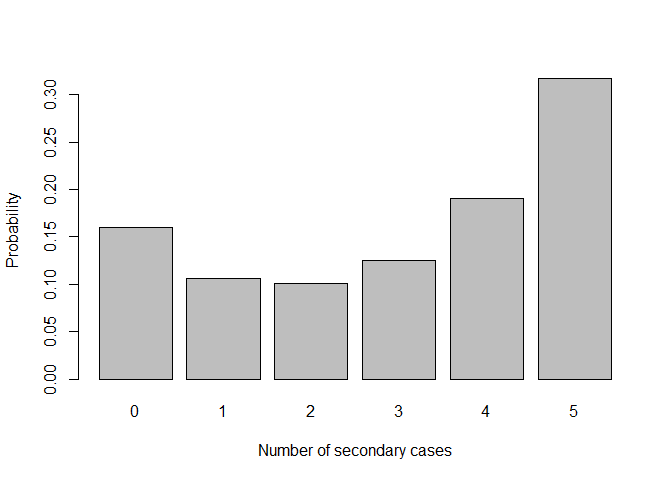

outbreakdistr
================

This package contains functions for computing the probability
distributions for the sizes of outbreaks of communicable diseases in
closed groups. The methods are exact, meaning they don’t rely on
simulation methods. The package is mostly suitable for smaller outbreaks
(households, schools, etc), but not outbreaks in larger groups such as
cities or countries. This is because the methods tend to be slow and
numerically unstable for larger groups.

This package is in early stages of development, functionality and
interface will probably change substantially.

Currently implemented:

- Final Size methods from Ball (1986): Single type and multitype
  populations, with different infectious period distributions.
- Epidemic Markov Models: Continuous time SIR and SIS models, discrete
  time SIR.

Keywords: Infectious disease modelling, Final size distribution.

## Installation

To install the latest development version:

``` r
devtools::install_github("opisthokonta/outbreakdistr")
```

## Examples

First we must load the package:

``` r
library(outbreakdistr)
```

### Final Size distribution with general infectious period

The method from Ball (1986) is implemented in the fsdistr function. Here
is how to compute the final size distribution with infection rate beta =
1.5, and the infectious period is exponentially distributed with rate
gamma = 1, in a population of 7 people, with two primary cases and 5
initially susceptible. This corresponds to a basic reproduction number
R0 = 1.5.

``` r
fs_res1 <- fsdistr(s0 = 5, i0 = 2, beta = 1.5, ip_model = 'exponential', ip_params = c(1.0))

barplot(height = fs_res1, names.arg = 0:5, xlab = 'Number of secondary cases', ylab = 'Probability')
```

<!-- -->

Here is the probability distribution if the infectious period is
constant, with length of 1 unit of time:

``` r
fsdistr(s0 = 5, i0 = 2, beta = 1.5, ip_model = 'constant', ip_params = c(1.0))
```

    ## [1] 0.04978707 0.06164073 0.09069475 0.15485522 0.27250941 0.37051282

and here is the probability distribution if the infectious period
follows a gamma distribution, with rate parameter 2 and shape parameter
3:

``` r
fsdistr(s0 = 5, i0 = 2, beta = 1.5, ip_model = 'gamma', ip_params = c(3, 2))
```

    ## [1] 0.03481543 0.03026028 0.03860363 0.07220707 0.19205901 0.63205459

### Multitype Final Size distribution with general infectious period

An extension to a multitype (multivariate) scenario has also been
implemented. In this example we consider two groups, where the second
group has much lower susceptibility (perhaps due to vaccination). The
second group has exponentially distributed infectious period, while the
first group has gamma distributed infectious period. The infectious
period parameters need to be specified using a list. The result is a
named vector showing the joint probability distribution of the number of
secondary cases in each group.

``` r
i0 <- c(1,0) # primary case in first group.
s0 <- c(3,3)
beta_matrix <- matrix(0.8*c(1,0.2,1,0.2), ncol = 2, nrow= 2)

fs_mt_res <- fsdistr_mt(s0 = s0, i0 = i0, beta = beta_matrix, 
                        ip_model = c('gamma', 'exponential'), 
                        ip_params = list(c(3, 2), c(1.1)))

fs_mt_res
```

    ##         0-0         1-0         2-0         3-0         0-1         1-1 
    ## 0.364431487 0.072701946 0.021152452 0.004938654 0.153700211 0.089503247 
    ##         2-1         3-1         0-2         1-2         2-2         3-2 
    ## 0.049557161 0.019177601 0.037943725 0.050029355 0.049113215 0.030648027 
    ##         0-3         1-3         2-3         3-3 
    ## 0.004642047 0.012168926 0.020252234 0.020039711

It can be useful to also look at the marginal distributions of the
number of secondary cases in each group. Notice how the group with low
susceptibility has much higher chance of no cases.

``` r
# Group 1
sapply(split(fs_mt_res, f = substr(names(fs_mt_res), start = 1, stop = 1)), FUN = sum)
```

    ##          0          1          2          3 
    ## 0.56071747 0.22440348 0.14007506 0.07480399

``` r
# Group 2
sapply(split(fs_mt_res, f = substr(names(fs_mt_res), start = 3, stop = 3)), FUN = sum)
```

    ##          0          1          2          3 
    ## 0.46322454 0.31193822 0.16773432 0.05710292

# Markov models

The Epidemic Markov model is a discrete state model where the states are
the number of susceptible and infectious individuals in the population.
The continuous time version of the model is implemented in the emmct
function. Lets take a look at the cumulative incidence a short period
after (0.7 infectious periods) the outbreak starts:

``` r
emmct_res <- emmct(s0 = 5, i0 = 2, beta = 1.5, gamma = 1, time = 0.7)
emmct_res$fs_distr
```

    ## [1] 0.25428255 0.24942035 0.22253465 0.16142656 0.08631204 0.02602385

Lets take a look at how it looks some time later (4 infectious periods).
Notice how the distribution is similar to the one computed in the very
first example.

``` r
emmct_res2 <- emmct(s0 = 5, i0 = 2, beta = 1.5, gamma = 1, time = 4)
emmct_res2$fs_distr
```

    ## [1] 0.1600218 0.1061709 0.1023895 0.1296803 0.1992438 0.3024937

``` r
# compare withe final size distribution with exponential infectious period
fs_res1
```

    ## [1] 0.1600000 0.1059354 0.1011009 0.1251991 0.1908230 0.3169416

The discrete time version of the Epidemic Markov Model (function emmdt)
can be used to compute the final size distribution, which should match
the result from fsdistr. The emmdt is more numerically stable for larger
population sizes than fsdistr in my experience.

``` r
emmdt_res <- emmdt(s0 = 5, i0 = 2, beta = 1.5, gamma = 1)
emmdt_res$fs_distr
```

    ## [1] 0.1600000 0.1059354 0.1011009 0.1251991 0.1908230 0.3169416

## Other packages

The [chainbinomial](https://github.com/opisthokonta/chainbinomial)
package implements outbreak distributions using Chain Binomial models,
including methods for estimation and regression modelling. The
[finalsize](https://github.com/epiverse-trace/finalsize) can be used to
compute the expected values for models, including larger populations.

## References

- Ball, Frank (1986) A unified approach to the distribution of total
  size and total area under the trajectory of infectives in epidemic
  models
